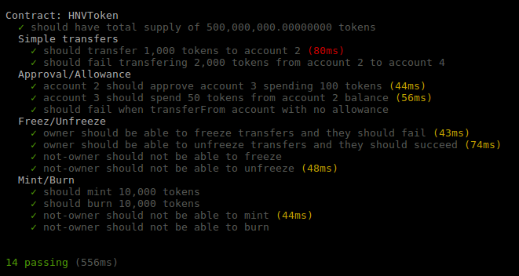

# Hiveterminal Token (HVN)

This is implementation of HVN, an ERC20 token.

Implementation supports also following protections:
- Freez and UnFreez transfers
- Short address protection

## Implementation

The HVN token system is implemented using Solidity, the most widely used high level language targeting the EVM. 

### Test Results

Following is test results that we have

  

#### Copyright &copy; 2017  Hive Project Ltd.
